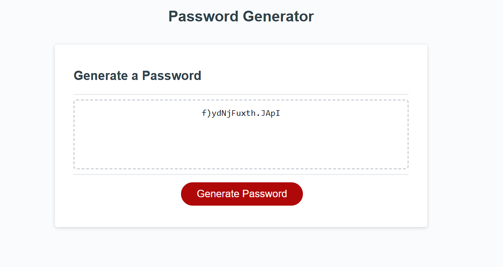

# Password Generator

Deployed on github pages, you can view it [here](https://ianssenne.github.io/ch-password-generator/)

## Objective

To create a website that allows you to generate a secure password.

## Technologies Used

| name       | usage                                   |
| :--------- | :-------------------------------------- |
| javascript | used for basic templating of components |
| prettier   | used for formatting of files            |

- the html and css was provided as part of a template project and therefore not included in the used technologies.

## The Final Version of the password generator webpage



## features

- password length selection
- password character categories selection
- password output
- input validation.

## configurations

### .prettierrc

```json
{
	"useTabs": true
}
```
